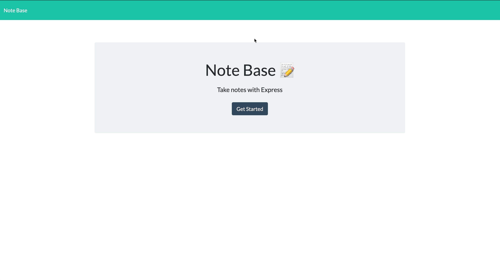

# Note Base

A note taking application which allows users to create, read and delete notes. This project uses Node.js with Express.js and other dependencies.

## Table of Contents

- [Installation](#installation)
- [Usage](#usage)
- [License](#license)
- [Contributing](#contributing)
- [Tests](#tests)
- [Questions](#questions)

## Installation

To install this application,

- clone this repo
- on terminal run `npm i` to install the dependencies
- to run the application, on terminal execute `npm start`

## Usage

This application is intended to be used for creating a list of notes via the frontend.

Please refer to the demo below:

## License

This project is covered under: **The Unlicense**

A license with no conditions whatsoever which dedicates works to the public domain. Unlicensed works, modifications, and larger works may be distributed under different terms and without source code.

For license details: [click here](https://choosealicense.com/licenses/unlicense/)

## Contributing

If you're interested in contributing to this project, please clone this repository, make improvements and open a pull request with explanation of the improvements.

## Tests

To test this application, please write the test file using your preferred testing framework and run `npm test` in your terminal.

## Questions

- This project is created and maintained by: [hari-ls](https://github.com/hari-ls)
- If you have addtional questions about this project, please feel free to reach out at: [hari@logicsync.com.au](mailto:hari@logicsync.com.au)
